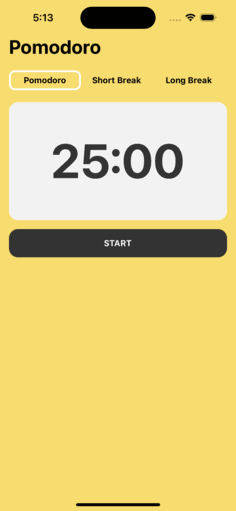

# Pomodoro App

## Descripción

La aplicación **Pomodoro** es una herramienta de gestión del tiempo basada en la técnica Pomodoro, que divide el trabajo en intervalos de tiempo llamados "pomodoros", seguidos de breves descansos. Esta aplicación te permite personalizar la duración de tus pomodoros, descansos cortos y largos.

## Tecnologías Utilizadas

- **React Native**: El framework de desarrollo móvil basado en React que permite construir aplicaciones nativas para iOS y Android.

- **Expo**: Una plataforma que simplifica el desarrollo de aplicaciones React Native al proporcionar herramientas y servicios adicionales.

- **React Hooks (useState, useEffect)**: Utilizados para gestionar el estado y los efectos secundarios en componentes funcionales.

- **React Native Audio (Expo-AV)**: Librería para reproducir sonidos en la aplicación. En este caso, se utiliza para reproducir un sonido al iniciar cada pomodoro.

## Estructura de la App

### Componentes

#### 1. `App`

- **Descripción**: Componente principal que gestiona el estado global de la aplicación y contiene la lógica principal del temporizador Pomodoro.

- **Funcionalidades Principales**:
  - Iniciar/Parar el temporizador Pomodoro.
  - Cambiar entre diferentes modos de tiempo (Pomodoro, Descanso Corto, Descanso Largo).

#### 2. `Header`

- **Descripción**: Componente que muestra las opciones de tiempo (Pomodoro, Descanso Corto, Descanso Largo) y permite al usuario seleccionar el tipo de temporizador.

- **Funcionalidades Principales**:
  - Cambiar el tiempo del temporizador según la opción seleccionada.

#### 3. `Timer`

- **Descripción**: Componente encargado de mostrar el tiempo restante en formato de minutos y segundos.

### Estilos

- Estilos básicos para la apariencia de la aplicación, como colores, tamaños de fuente y estilos de botones.

## Ejecución del Proyecto

1. Clona este repositorio.
2. Instala las dependencias con `npm install` o `yarn install`.
3. Ejecuta la aplicación con `expo start`.

¡Disfruta de una gestión efectiva del tiempo con la técnica Pomodoro! 🍅✨
